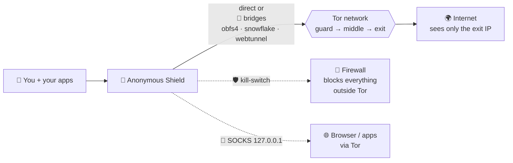

# 🛡️ Anonymous Shield — Tor client for desktop (Windows)

**Tor** client for Windows built with **Python + PyQt6 + official tor**,
inspired by Orbot: onion button with real bootstrap progress, exit IP/country,
bridges (obfs4/snowflake/webtunnel), upstream proxy, local SOCKS, DNSCrypt,
total protection (Windows proxy + firewall kill-switch), and in-app updates.

> **Tor™** is a trademark of The Tor Project, Inc. — this product is **not**
> affiliated with or endorsed by them. Official site: https://www.torproject.org/

## 📥 Download

Go to [**Releases**](../../releases) and grab `AnonymousShield.exe` from the
version you want (automatically built by GitHub Actions on every `v*` tag).
No Python install needed: PyQt6, Tor and transports ship embedded.

## 🎭 How it works



1. You click **Connect** 🧅 — Tor bootstraps to 100%.
2. Traffic detours through 3 relays; sites see only the **exit IP**.
3. Censored network? Pick a **bridge** 🌉 to disguise Tor traffic.
4. **Kill-switch** 🧱 cuts anything trying to bypass Tor.
5. One click to disconnect — proxy + firewall restored automatically.

## 🧪 Experimental — help wanted

- **VPN (Tor-over-VPN / OpenVPN próprio):** ⚠️ recurso ainda **não validado**
  em campo — se testar, [abra uma issue](../../issues) contando o resultado
  (provedor, modo, funcionou ou não). Testadores são bem-vindos!
- Gostou do projeto e quer ver esse e outros recursos evoluindo?
  ☕ **[Compre-me um café](https://www.buymeacoffee.com/SEU-USUARIO)** — qualquer
  valor ajuda a pagar tempo de desenvolvimento e testes.

## 📁 Layout

```
anonymous-shield/   app (main.py, anonshield/, assets/, vendor/, tests/)
  vendor/           official tor.exe + lyrebird/conjure + GeoIP + licenses
.github/workflows/ exe build + automatic Release
LICENSE / LICENSE-APACHE   dual-licensed code: Apache-2.0 OR GPL-3.0
```

## 🔨 Run from source / build

```bash
cd anonymous-shield
pip install -r requirements.txt
python main.py            # run
python -m PyInstaller --noconfirm AnonymousShield.spec   # build the exe
```

## ⚠️ Legal disclaimer

- This software is provided **"as is", without warranties** of any kind.
  The authors are **not liable** for damages, data loss, identity exposure
  or misuse.
- **No tool guarantees absolute anonymity.** Real protection also depends on
  your behavior (logins, torrents, plugins, WebRTC, etc.). Study opsec before
  trusting any software with your safety.
- Independent project, **not affiliated with or endorsed by** The Tor Project.
  **Tor™** is a trademark of The Tor Project, Inc. — https://www.torproject.org/
- Use in compliance with **your local laws**. Illegal activity stays illegal
  behind any tool.

## 📄 License

Own code under **dual license Apache-2.0 / GPL-3.0** (see `LICENSE-APACHE`
and `LICENSE`). Bundles third-party software: Tor (BSD-3-clause),
OpenSSL (Apache-2.0), libevent, zlib — full texts on the app's **About**
page and under `anonymous-shield/vendor/docs/`.
