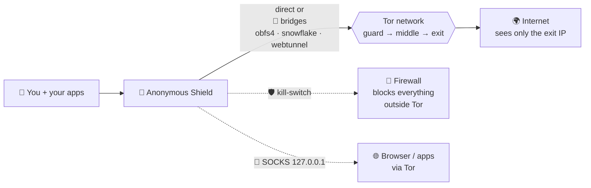

# 🛡️ Anonymous Shield — Tor client for desktop (Windows)

**Tor** client for Windows built with **Python + PyQt6 + official tor**,
inspired by Orbot: onion button with real bootstrap progress, exit IP/country,
bridges (obfs4/snowflake/webtunnel), upstream proxy, local SOCKS, DNSCrypt,
total protection (Windows proxy + firewall kill-switch), and in-app updates.

🌍 **50 languages supported** (PT-BR/EN/ES fully translated, the rest via
English fallback) — **more translations rolling out.**

> **Tor™** is a trademark of The Tor Project, Inc. — this product is **not**
> affiliated with or endorsed by them. Official site: https://www.torproject.org/

## 📥 Download

Go to [**Releases**](../../releases) and grab `AnonymousShield.exe` from the
version you want (automatically built by GitHub Actions on every `v*` tag).
No Python install needed: PyQt6, Tor and transports ship embedded.

## 🎭 How it works



1. You click **Connect** 🧅 — Tor bootstraps to 100%.
2. Traffic detours through 3 relays; sites see only the **exit IP**.
3. Censored network? Pick a **bridge** 🌉 to disguise Tor traffic.
4. **Kill-switch** 🧱 cuts anything trying to bypass Tor.
5. One click to disconnect — proxy + firewall restored automatically.

## 🧪 Experimental — help wanted

- **VPN (Tor-over-VPN / own OpenVPN):** ⚠️ feature **not yet field-validated**
  — if you test it, [open an issue](../../issues) with the result
  (provider, mode, worked or not). Testers welcome!
- Like the project and want this and other features to evolve?
  ☕ **[Donate via PayPal](https://www.paypal.com/donate/?hosted_button_id=U9K49V44Q7PAE)** — any
  amount helps pay for development and testing time.

## ✨ What each page does

- **Dashboard** — overview: Tor status, exit IP and quick actions.
- **Tor** — connect/disconnect and follow bootstrap progress.
- **Total protection** — Windows proxy + firewall kill-switch (Tor or nothing).
- **Apps** — choose which apps use Tor; open programs through Tor.
- **Bridges** — anti-censorship transports (obfs4, snowflake, webtunnel).
- **Upstream** — provider/VPN proxy before Tor.
- **DNS** — DNS over Tor or local DNSCrypt.
- **VPN** — own OpenVPN over Tor (🧪 experimental, unvalidated).
- **Scanner** — network/port scan (nmap or built-in).
- **Logs** — app events + Tor log, with **never-store-logs** mode.
- **Diagnostics** — tests, leak check and internet restore.
- **Update** — update the app via GitHub release or URL.
- **About** — version, attribution and full license texts.
- **Local accounts** — optional profiles with saved preferences, per-user
  encrypted vault and separate Tor data (or guest mode, no password).

(Hover any sidebar item in the app for the same hint in your language.)

## 🐧 Linux (Debian/Ubuntu — beta)

**Via .deb (recommended):** grab `anonymous-shield_*_amd64.deb` from
[**Releases**](../../releases) and `sudo dpkg -i *.deb` (deps via apt).
Installs to `/opt`, adds a menu shortcut, and uses the **system Tor** —
no embedded binary on Linux.

**From source:**

```bash
sudo apt install -y tor obfs4proxy python3-pyqt6 python3-pip python3-venv
git clone https://github.com/Abaddon2010/anonymous-shield.git
cd anonymous-shield/anonymous-shield
python3 -m venv .venv && source .venv/bin/activate
pip install -r requirements.txt
python3 main.py
```

Linux firewall kill-switch uses **nftables** (root via pkexec) with an
allowlist of current guards; system proxy via GNOME. Snowflake is
incompatible with the kill-switch (dynamic UDP).

## 🛡 Leak protection (no leaks outside Tor)

Real IP can escape Tor three ways — **WebRTC** (browser leaks IP via STUN),
**DNS** (queries outside the tunnel, incl. browser DoH bypassing proxy) and
**unproxied apps** (Chrome ignores env vars). This app counters all three:

- **Dedicated profiles** — Chromium forced via `--proxy-server` + Tor profile;
  Firefox via `user.js` (WebRTC off, DoH off, remote DNS over SOCKS).
- **Per-app** — each program gets its own SOCKS port + switch.
- **🧱 Kill-switch** — firewall drops everything that isn't Tor
  (Windows: netsh block-all + allow Tor; Linux: nftables guard allowlist).
- **Leak test button** — opens `ipleak.net` in the locked-down browser so
  you can *see* nothing leaks (IP, DNS, WebRTC).
- **🥷 Stealth mode** (Tor page, 1 click) — VPN + obfs4 + never-store-logs
  against ISP snooping.

## 🔄 Tor refresh policy

Bundled Tor comes from the official **Tor Expert Bundle** (Windows) and
system packages (Linux). Because an outdated Tor is a real security risk:

- Check for Tor security releases **every ~2 months** at
  https://www.torproject.org/download/tor/ and
  https://blog.torproject.org/.
- Windows refresh: replace `anonymous-shield/vendor/tor/` +
  `vendor/data/geoip*` with the new Expert Bundle, update `tor_ver`
  expectations, rebuild, tag a release.
- Linux needs nothing (uses distro `tor` via apt).
- The Update page shows the bundled Tor version (`Tor x.y.z`).

## 📁 Layout

```
anonymous-shield/   app (main.py, anonshield/, assets/, vendor/, tests/)
  vendor/           official tor.exe + lyrebird/conjure + GeoIP + licenses
.github/workflows/ exe build + automatic Release
LICENSE / LICENSE-APACHE   dual-licensed code: Apache-2.0 OR GPL-3.0
```

## 🔨 Run from source / build

```bash
cd anonymous-shield
pip install -r requirements.txt
python main.py            # run
python -m PyInstaller --noconfirm AnonymousShield.spec   # build the exe
```

## ⚠️ Legal disclaimer

- This software is provided **"as is", without warranties** of any kind.
  The authors are **not liable** for damages, data loss, identity exposure
  or misuse.
- **No tool guarantees absolute anonymity.** Real protection also depends on
  your behavior (logins, torrents, plugins, WebRTC, etc.). Study opsec before
  trusting any software with your safety.
- Independent project, **not affiliated with or endorsed by** The Tor Project.
  **Tor™** is a trademark of The Tor Project, Inc. — https://www.torproject.org/
- Use in compliance with **your local laws**. Illegal activity stays illegal
  behind any tool.

## 📄 License

Own code under **dual license Apache-2.0 / GPL-3.0** (see `LICENSE-APACHE`
and `LICENSE`). Bundles third-party software: Tor (BSD-3-clause),
OpenSSL (Apache-2.0), libevent, zlib — full texts on the app's **About**
page and under `anonymous-shield/vendor/docs/`.
